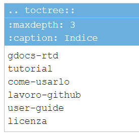

.. _h317c7246b4714a387ea464e255c65:

Le funzioni su Google doc
*************************

.. _h79285c4e7257194524363d5a1e617d44:

Per i principianti dei file RST
===============================

Se sei all’inizio della conoscenza dei file RST (restructuredText) e ti senti un po confuso sul come inserire i tuoi documenti sul portale di Read the Docs, questo strumento fa per te. Con GGeditor e questo piccolo tutorial tradotto in italiano dal tutorial originale, spero che potrai essere assistito nel realizzare il tuo lavoro in maniera facile e veloce. 

|

.. _h665b13f663e6519330123b6940202c:

Il plug-in di Google Doc
========================

Per prima cosa da Google Doc si va su "Componenti aggiuntivi", si cerca  e si installa il plug-in “GGeditor”

\ |IMG1|\  

così si può cominciare ad usare il set di strumenti del menù che appare se clicchiamo su "componenti aggiuntivi", poi su "GGeditor" e poi ancora su "Show Markup Panel".

|

.. _h493657176f3a69a446e5e556f6275:

I settings dell’account Github
==============================

\ |IMG2|\ 

Dalla finestra “settings” è possibile agganciare il proprio account Github al plugin GGeditor in maniera tale che ogni volta che vogliamo commissionare un Google Doc su Gihub, cliccando su “Commit to Github” è possibile visualizzare l’elenco dei nostri repository su Github. Si seleziona quel repository che ci interessa sul quale intendiamo lavorare e si procede con l’azione di Commit del Google Doc.

L’operazione è molto semplice e alla portata di tutti perchè non richiede particolari conoscenze specifiche.

|

.. _h96481b373011705e781746f262f0:

Il Markup Panel
===============

Cliccando su su "Show Markup Panel" viene visualizzato questo pannello.\ |IMG3|\  

che ci consente di inserire sul documento in Google Doc:

* Note colorate, personalizzabili nel titolo;

* Codice da illustrare in una pagina HTML;

* Tabella dell'indice dei contenuti (cioè il titolo delle pagine che compongono l'indice dei contenuti).

|

.. _h4e3124764f272f2e5140635c69434d1a:

La costruzione dell’indice del documento
========================================

Dal Markup Panel è possibile costruire l’indice del documento da visionare su Read the Docs.

Una volta inserita la maschera come di seguito rappresentato, basta editare il titolo delle altre pagine Google Doc che avete creato dentro la stessa directory di Google Drive. Sul file .rst che GGeditor crea verrà creato un indice che a sua volta verrà visualizzato su Read the Docs.

La procedura è di estrema facilità. 

Dopo ``:caption:`` è possibile scrivere il nome che si vuole dare all’indice, o semplicemente scrivere “indice”. Ogni volta che si crea un nuovo Google Doc da agganciare all’indice basta riportare il titolo del Google Doc in questa maschera.

\ |IMG4|\ 

|

.. _h20557f3997523b367c672f10583f2a:

Blocchi di codice
=================

|

.. _h577b282b652a133d475a216414d3a41:

senza righe numerate
--------------------

.. code:: 

    #!/usr/bin/env python
    
    """
    Twisted moved the C{twisted} hierarchy to the C{src} hierarchy, but C{git}
    doesn't know how to track moves of directories, only files.  Therefore any
    files added in branches after this move will be added into ./twisted/ and need
    to be moved over into
    """
    
    import os
    from twisted.python.filepath import FilePath
    
    here = FilePath(__file__).parent().parent()
    fromPath = here.child("twisted")
    toPath = here.child("src")
    
    for fn in fromPath.walk():
        if fn.isfile():
            os.system("git mv {it} src/{it}"
                      .format(it="/".join(fn.segmentsFrom(here))))
    
    os.system('git clean -fd')
    
    def outer(x):
    def indent_start(x):
        go start start
        go start end
    
    def end(y):
        go end start
        go end end

|

.. _h477f4023e6f37514b3e5a371a681858:

con righe numerate
------------------

.. code-block:: python
    :linenos:

    #!/usr/bin/env python
    
    """
    Twisted moved the C{twisted} hierarchy to the C{src} hierarchy, but C{git}
    doesn't know how to track moves of directories, only files.  Therefore any
    files added in branches after this move will be added into ./twisted/ and need
    to be moved over into
    """
    
    import os
    from twisted.python.filepath import FilePath
    
    here = FilePath(__file__).parent().parent()
    fromPath = here.child("twisted")
    toPath = here.child("src")
    
    for fn in fromPath.walk():
        if fn.isfile():
            os.system("git mv {it} src/{it}"
                      .format(it="/".join(fn.segmentsFrom(here))))
    
    os.system('git clean -fd')
    
    def outer(x):
    def indent_start(x):
        go start start
        go start end
    
    def end(y):
        go end start
        go end end

|

.. _h5d535b7f2e655f2e1f3e4c6225335713:

Note colorate di vario tipo
===========================

..  Attention:: 

    (content of Attention)

..  Caution:: 

    (content of Caution)

..  Warning:: 

    (content of Warning)

..  Danger:: 

    (content of Danger)

..  Error:: 

    (content of Error)

..  Hint:: 

    (content of Hint)

..  Important:: 

    (content of Important)

..  Tip:: 

    (content of Tip)

..  Note:: 

    (content of Note)

..  seealso:: 

    (content of See also)

.. admonition:: Change-me

    (content of Change-me)

|

.. _h496a7729534b3e4c36782439686453:

Altre (tante) funzioni di GGeditor
==================================

\ |IMG5|\ 

Inline Markups, Table, Image, Conversion.

\ |LINK1|\  e \ |LINK2|\  sono descritte molte funzioni che possono essere attivate con GGeditor, quale per esempio quella della \ |STYLE0|\ , quindi con la sintassi tipica di questo linguaggio.

|

.. _h5e47743d14d4a78484827c42059:

Conversione di testo da Google doc a file .RST per il download
==============================================================

Il componente aggiuntivo GG editor permette anche la funzione di conversione del testo in linguaggio .RST (vedi \ |LINK3|\  per le funzioni complete di conversione). Praticamente è possibile, tramite una finestra dedicata, far convertire a GGeditor testo direttamente in linguaggio .RST.  Si può convertire tutto il testo, una parte, o ad esempio una tabella. Ci sono delle regole di conversione già illustrate nella stessa finestra denominata “Conversion”. Una volta convertito il testo appare un messaggio di avvenuta conversione ed è possibile effettuare il download del testo convertito in formato .RST oppure selezionarlo e copiarlo in un editor testuale per un ulteriore riuso.

\ |IMG6|\ 

|REPLACE1|

|REPLACE2|

.. bottom of content

.. |STYLE0| replace:: **conversione del contenuto del nostro Google Doc in un file formato RST**

.. |REPLACE1| raw:: html

    
    
    

    
    <noscript>Please enable JavaScript to view the <a href="https://disqus.com/?ref_noscript">comments powered by Disqus.</a></noscript>
.. |REPLACE2| raw:: html

    <a href="https://twitter.com/cirospat?ref_src=twsrc%5Etfw" class="twitter-follow-button" data-show-count="false">Follow @cirospat</a>

.. |LINK1| raw:: html

    <a href="http://ggeditor.readthedocs.io/en/latest/User%20Guide.html" target="_blank">Qui</a>

.. |LINK2| raw:: html

    <a href="http://ggeditor.readthedocs.io/en/latest/Examples.html" target="_blank">qui (esempi)</a>

.. |LINK3| raw:: html

    <a href="http://ggeditor.readthedocs.io/en/latest/User%20Guide.html#conversion" target="_blank">link</a>

.. |IMG1| image:: static/come-usarlo_1.png
   :height: 109 px
   :width: 485 px

.. |IMG2| image:: static/come-usarlo_2.png
   :height: 213 px
   :width: 601 px

.. |IMG3| image:: static/come-usarlo_3.png
   :height: 496 px
   :width: 292 px

.. |IMG5| image:: static/come-usarlo_5.png
   :height: 294 px
   :width: 290 px

.. |IMG6| image:: static/come-usarlo_6.png
   :height: 274 px
   :width: 601 px
