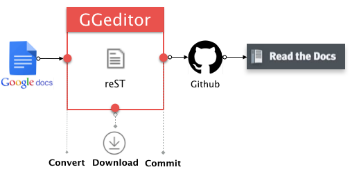

|REPLACE1|

.. _h3d36331c7272261a3f654118715c385f:

Da Google Doc direttamente a Read the Docs con GGeditor
=======================================================

\ |IMG1|\ 

Questo documento rappresenta una via facile per migliorare la qualità dei documenti pubblicati sul web, ed è la traduzione in italiano del \ |LINK1|\ . 

Nasce subito dopo la produzione del tutorial “\ |LINK2|\ ”.

\ |IMG2|\ 

\ |LINK3|\  è un componente plugin che si installa direttamente da Google Doc della suite di Google Drive. Google Drive (e i suoi servizi) oggi è molto usato anche nelle Pubbliche Amministrazioni, oltre che dai privati, per la facilità d’uso e per la funzionalità di condivisione dei documenti in gruppo.

|REPLACE2|

|

.. admonition:: Le principali funzioni di GGeditor sono

    * Facile inizio per chi non ha dimestichezza con i file RST, anche per chi non ha idea dei marcatori di RST.
    
    * Alimentato da Google Docs. Quasi la totalità di quello che vedi su Google Docs è quello che ottieni su Readthedocs. Lo stesso è per l'intero gruppo di lavoro.
    
    * Un click per commissionare il lavoro sul repository di Github.
    
    * Puoi vedere in anteprima il file RST generato dall'interno di Google Docs e scaricarlo nel tuo PC.
    
    * Supporta headings, bold, italic, hyperlink, subscript e superscript.
    
    * Supporta note a margine, immagini, liste di articolo e tabelle.
    
    * Supporta caratteri a larghezza intera (CKJ) nelle intestazioni e nelle tabelle.
    
    * Supporta i link interni ai bookmarks, headings e le Google Docs tabelle native di contenuti (in document table of contents).
    
    * Supporta i link relativi ai file RST generati dai Google Docs all'interno della stessa directory e sotto-directory Google Docs.
    
    * Supporta la tabella dei contenuti  (cross-document table of content (.. toctree::)) per fare generare l'indice a Readthedocs.
    
    * Supporta tutti gli stili di "admonitions" di Readthedocs.
    
    * Supporta account multipli per compilare i file nei repository di diversi account Github.
    
    * Supporta la conversione di tabelle con i tags HTML to let look-and-feel e la stessa cosa è possibile per i blogger.

--------

.. toctree:: 
    :maxdepth: 3
    :caption: Indice 

    gdocs-rtd
    tutorial
    come-usarlo
    lavoro-github
    user-guide
    licenza

--------

|REPLACE3|

--------

|REPLACE4|

|REPLACE5|

.. bottom of content

.. |REPLACE1| raw:: html

    <a href="https://twitter.com/cirospat?ref_src=twsrc%5Etfw" class="twitter-follow-button" data-show-count="false">Follow @cirospat</a>
.. |REPLACE2| raw:: html

    <iframe width="100%" height="380" src="https://www.youtube.com/embed/5O2D4h5hI18" frameborder="0" allow="autoplay; encrypted-media" allowfullscreen></iframe>
    Breve video introduttivo (2’10”)
.. |REPLACE3| raw:: html

    
&nbsp;&nbsp;<strong>S</strong><strong>ervizi di&nbsp;<a href="http://opendatasicilia.it/" rel="nofollow noopener" style="color: #3366ff;" target="_blank">OpendataSicilia</a></strong>

    
&nbsp; &nbsp; &nbsp;&nbsp; &nbsp; &nbsp;&nbsp;&nbsp;

    
<a href="http://albopop.it/" rel="nofollow noopener" target="_blank">Albo Pop</a>&nbsp; &nbsp;&nbsp;<a href="http://www.foiapop.it/" rel="nofollow noopener" target="_blank">FOIA Pop</a>&nbsp; &nbsp;&nbsp;<a href="http://www.visualcad.it/" rel="nofollow noopener" target="_blank">Visual CAD</a>&nbsp;<strong>&nbsp;</strong>

    
Licenza&nbsp;

    
<strong>OpendataSicilia</strong> &egrave; una iniziativa civica condivisa da pi&ugrave; persone, che si propone di far conoscere e diffondere la cultura dell'open government e le prassi dell'open data nel nostro territorio e aprire una discussione pubblica partecipata. Siamo anche su:

    <ul style="list-style-type: disc;">
    <li>la <a href="https://groups.google.com/forum/#!forum/opendatasicilia" target="_blank" rel="noopener" style="color: #0000ff;">mailing list</a> di lavoro;</li>
    <li>il <a href="http://opendatasicilia.it" target="_blank" rel="noopener">blog</a>;</li>
    <li>il gruppo <a href="https://www.facebook.com/groups/opendatasicilia" target="_blank" rel="noopener">facebook</a>;</li>
    <li>l'account <a href="http://twitter.com/opendatasicilia" target="_blank" rel="noopener" style="color: #3366ff;">twitter</a>;</li>
    <li>il canale <a href="http://opendatasicilia.slack.com" target="_blank" rel="noopener">Slack</a>&nbsp;(<a href="http://slack.opendatasicilia.it" target="_blank" rel="noopener">per iscriversi</a>).</li>
    </ul>
    
.. |REPLACE4| raw:: html

    
    
    

    
    <noscript>Please enable JavaScript to view the <a href="https://disqus.com/?ref_noscript">comments powered by Disqus.</a></noscript>
.. |REPLACE5| raw:: html

    <a href="https://twitter.com/cirospat?ref_src=twsrc%5Etfw" class="twitter-follow-button" data-show-count="false">Follow @cirospat</a>

.. |LINK1| raw:: html

    <a href="http://ggeditor.readthedocs.io/en/latest/" target="_blank">tutorial GGeditor</a>

.. |LINK2| raw:: html

    <a href="http://come-creare-guida.readthedocs.io/it/latest/" target="_blank">Come abbiamo creato un «Read the Docs» per pubblicare documenti pubblici su Docs Italia</a>

.. |LINK3| raw:: html

    <a href="https://chrome.google.com/webstore/detail/ggeditor/piedgdbcihbejidgkpabjhppneghbcnp" target="_blank">GGeditor</a>

