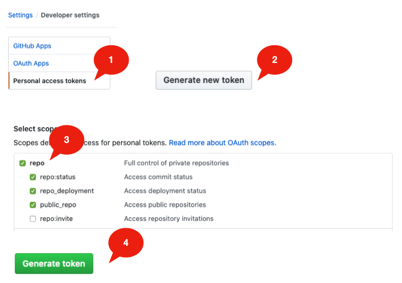
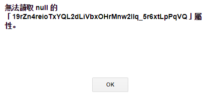
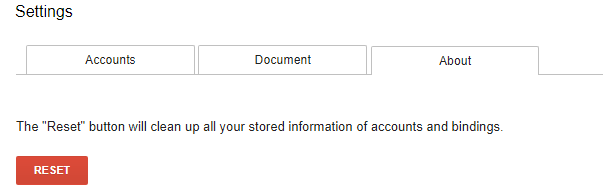

.. _h6a7a1e645a337922f59342e6d452959:

Da Google Doc con "GGeditor" → via GitHub → a Read-the-Docs 
############################################################

|REPLACE1|

|REPLACE2|

Le spiegazioni contenute in questo tutorial rappresentano una via per migliorare la qualità dei documenti pubblicati sul web e sono la traduzione in italiano del \ |LINK1|\ . Il tutorial spiega come usare lo strumento di \ |STYLE0|\ , ed un componente aggiuntivo, per pubblicare documenti con lo stile di \ |STYLE1|\  utilizzando anche \ |STYLE2|\ .

Questo documento nasce subito dopo la produzione del tutorial “\ |LINK2|\ ”.

.. admonition:: Per questo tutorial i seguenti ringraziamenti particolari

    Ringraziare queste persone è importante, perché con i loro approfondimenti hanno permesso di ampliare le possibilità d’uso di ``Read the Docs`` come piattaforma di pubblicazione documentale:
    
    \ |LINK3|\ , \ |LINK4|\ , \ |LINK5|\ , \ |LINK6|\ , \ |LINK7|\ , \ |LINK8|\ , \ |LINK9|\ , \ |LINK10|\ , \ |LINK11|\ , \ |LINK12|\ .

|

.. _h387bd41572c6e60811453b41204663:

Vantaggi dell’uso di “Read the Docs”
====================================

L’uso di ``Read the Docs`` come piattaforma di pubblicazione di documenti online ha i seguenti vantaggi rispetto al formato :guilabel:`PDF`:

|REPLACE3|

Per i nostalgici e dipendenti da documenti in formato :guilabel:`PDF` (non accessibili comodamente da dispositivi mobili), la documentazione esposta su ``Read the Docs`` permette di scaricare il contenuto dell’intero documento pubblicato online sia in formato :guilabel:`PDF` che :guilabel:`EPUB` oltre che :guilabel:`HTML`.

|REPLACE4|

|

.. _h3c6f7e24c7a7047332e107b3d623a39:

Changelog
=========

\ |STYLE3|\ 

.. admonition:: Aggiornamento N. 1 - gennaio_2020

    Su Google doc cliccando su “\ |STYLE4|\ ” non trovate più  “\ |STYLE5|\ ” neanche sul Marketplace di Google (capita dall’agosto 2019 per una ridefinizione dei termini d’uso di Google). Passate alla procedura del successivo aggiornamento.

|

.. admonition:: Aggiornamento N.2 - 14_febbraio_2020

    In alternativa all’installazione del componente aggiuntivo su Google doc (dall’elenco dei componenti aggiuntivi forniti da Google), le funzioni svolte da GGeditor possono anche essere assicurate creando un Google doc che contiene uno script con il codice sorgente del componente \ |STYLE6|\ . Una volta creato lo script (con la procedura di seguito illustrata) avviando il comando “Commit to Github” (percorso: componenti aggiuntivi / GGeditor / Commit to Github), è possibile creare automaticamente un file in formato ``.RST`` su Github partendo dal contenuto editato su Google doc.
    
    ↓
    
    \ |STYLE7|\ 
    
    Lo script è costituito dai seguenti files che si trovano dentro il repository \ |LINK13|\ :
    
    * conversion.html
    
    * explicitMarkup.html
    
    * generator.gs
    
    * github.html
    
    * properties.gs
    
    * reSTMetadata.gs
    
    * settings.html
    
    * sidebar.html
    
    * 程式碼.gs   (程式碼 in cinese significa :guilabel:`codice`)
    
    Per creare lo script su Google doc, andare su \ |STYLE8|\  / \ |STYLE9|\ . Nella pagina dello script copiare il codice dei 9 file di cui al repository \ |LINK14|\  dando lo stesso nome dei 9 file di cui sopra. Allo script così creato date il nome ``GGeditor``.

|

.. admonition:: Aggiornamento N.3 - 19_febbraio_2020

    Messaggio “\ |STYLE10|\ ” (“Credenziali errate di Github”) su GGeditor. Github ha deprecato la sua API di autenticazione per “\ |STYLE11|\ ” e “\ |STYLE12|\ ”, che è la causa principale del problema del messaggio “Bad Credential” ("Credenziali non valide"). 
    
    \ |LINK15|\ , basta sostituire la password con cui si entra nell'account Github con il  "\ |STYLE13|\ " quando si esegue il commit in GGEditor nel Google doc. I passi da seguire sono i seguenti:
    
    #. Vai alla \ |LINK16|\  e \ |STYLE14|\  in Github.com (\ |LINK17|\ ). Quindi copia il token di accesso personale negli appunti.
    
    #. Apri un documento Google e rimuovi tutte le credenziali archiviate precedentemente in GGEditor, quindi aggiungi un nuovo account Github con il token copiato come password.
    
    Guarda i passi da compiere nelle schermate di Github: 
    
    \ |IMG1|\ 

|

.. admonition:: Aggiornamento N. 4 - ottobre_2021

    Messaggio di “non compilazione” del progetto su readthedocs.org e soluzione (news di fine ottobre 2021). Guarda anche la relativa \ |LINK18|\ .
    
    Da fine ottobre 2021 su readthedocs.org compare una non compilazione del progetto (\ |STYLE15|\ ) legata alla versione di ``Sphinx``.  La soluzione è inserire nel file ``requirements.txt`` la seguente sintassi: 
    
    ``docutils<0.18`` 
    
    come di seguito illustrato.

1- avere un \ |LINK19|\  denominato ``requirements.txt`` con il seguente codice:

.. code-block:: python
    :linenos:

    sphinx-rtd-theme
    sphinx
    recommonmark
    markdown
    sphinx-markdown-tables
    docutils<0.18

2- avere un \ |LINK20|\  ``.readthedocs.yaml``  con il seguente codice: 

.. code-block:: python
    :linenos:

    version: 2
    python:
       install:
       - requirements: requirements.txt

|

.. admonition:: Aggiornamento N. 5 - maggio_2022

    Fortunatamente il :guilabel:`componente aggiuntivo` per Google Doc  ``GG editor`` è di nuovo disponibile nello store di Google per l’installazione. Vai al seguente link: \ |LINK21|\ 

|

.. admonition:: Messaggio di errore “undefined”, soluzione

    Nelle azioni di commit sul componente GGeditor potrebbe comparire un messaggio di “\ |STYLE16|\ ” ed un messaggio di error in lingua taiwanese.
    
    Ho aperto una issue (\ |LINK22|\ ) sul suo progetto Github e Hsin Yuan Yeh (autore di GGeditor) ha provveduto ad analizzare tempestivamente il problema ed ha fornito immediatamente una soluzione che è stata implementata nel codice sorgente di \ |STYLE17|\ .  
    
    Praticamente se dovesse capitare di leggere un messaggio “undefined” o un messaggio in lingua taiwanese del tipo 
    ↓
    
    \ |IMG2|\ 
    
    La cosa da fare è: 
    
    andare in “\ |STYLE18|\ ”, poi “\ |STYLE19|\ ” e quindi su “\ |STYLE20|\ ” dove si trova un tasto rosso di “\ |STYLE21|\ ” che cancella tutte le informazioni di collegamento agli account Github e ai relativi file nel repository.
    
    \ |IMG3|\ 
    
    Tutto ritorna in ordine e funziona correttamente nella procedura di Commit da Google Doc a Github. Ovviamente bisogna ricollegare il componente aggiuntivo GGeditor all’account di Github per poter continuare a effettuare i commits. Grazie Hsin Yuan Yeh per questa tempestiva soluzione al problema.

 |

.. _h5b7fc263f61617c4bc66273d6a13c:

L’utilità di GGeditor per i progetti di documentazione online
=============================================================

Il componente aggiuntivo \ |STYLE22|\  rappresenta uno strumento molto utile e comodo in quanto i servizi di Google Drive oggi sono molto usati anche nelle Pubbliche Amministrazioni, oltre che dai privati, per la facilità d’uso e per la funzionalità di condivisione dei documenti in gruppo.

Il lavoro principale che svolge il componente aggiuntivo \ |STYLE23|\  è quello di trasformare il testo editato su un foglio di Google doc in un file con linguaggio ``.RST`` dentro il repository di \ |STYLE24|\ . Github a sua volta permette la compilazione automatica dello stesso documento su \ |STYLE25|\  in pagine ``HTML`` . Sembra una cosa difficile nella descrizione, ma se lo faccio \ |LINK23|\  lo possono fare tutti, con un pizzico di pazienza e curiosità.

|REPLACE5|

|

.. _h326c7c56172c6c7e78645b106229165a:

Le principali funzioni e punti di forza di GGeditor
===================================================

* Facile inizio per chi non ha dimestichezza con i file ``RST``, anche per chi non ha idea dei marcatori di ``RST``.

* Alimentato da Google Docs. Quasi la totalità di quello che vedi su Google Docs è quello che ottieni su Read the Docs. Lo stesso è per l'intero gruppo di lavoro.

* Un click per commissionare il lavoro sul repository di Github.

* Puoi vedere in anteprima il file ``RST`` generato dall'interno di Google Docs e scaricarlo nel tuo PC.

* Supporta headings, bold, italic, hyperlink, subscript e superscript.

* Supporta note a margine, immagini, liste di articolo e tabelle.

* Supporta caratteri a larghezza intera (CKJ) nelle intestazioni e nelle tabelle.

* Supporta i link interni ai bookmarks, headings e le Google Docs tabelle native di contenuti (in document table of contents).

* Supporta i link relativi ai file ``RST`` generati dai Google Docs all'interno della stessa directory e sotto-directory Google Docs.

* Supporta la tabella dei contenuti  (cross-document table of content ``(.. toctree::)``) per fare generare l'indice a Read The Docs.

* Supporta tutti gli stili di "admonitions" di Read The Docs.

* Supporta account multipli per compilare i file nei repository di diversi account Github.

* Supporta la conversione di tabelle con i tags ``HTML`` to let look-and-feel e la stessa cosa è possibile per i blogger.

--------

.. toctree::
  :maxdepth: 2

  Home <https://googledocs.readthedocs.io>

.. toctree:: 
    :maxdepth: 3
    :caption: Indice 

    gdocs-rtd
    tutorial
    come-usarlo
    tabelle
    inserire_immagini_video
    lavoro-github
    lavoro-rtd
    user-guide
    hypothesis-partecipazione
    sintassi-rst
    sintassi-md
    pubblicare-su-docs-italia
    licenza
    opendatasicilia

..  Tip:: 

    \ |STYLE26|\  il contenuto di questa pagina che stai leggendo è editato in \ |LINK24|\  ♞ … dai un occhiata per capire meglio come il testo di Google doc viene esposto su pagine ``HTML`` di :guilabel:`Read the Docs`

|REPLACE6|

.. bottom of content

.. |STYLE0| replace:: **Google doc**

.. |STYLE1| replace:: **Read the Docs,**

.. |STYLE2| replace:: **GitHub**

.. |STYLE3| replace:: **Registro di tutti gli aggiornamenti | modifiche principali apportate al progetto**

.. |STYLE4| replace:: *installa componente aggiuntivo*

.. |STYLE5| replace:: **GGeditor**

.. |STYLE6| replace:: **GGeditor**

.. |STYLE7| replace:: **I file contenuti nello script da creare su Google doc**

.. |STYLE8| replace:: **menu strumenti**

.. |STYLE9| replace:: **< > editor di script**

.. |STYLE10| replace:: **Bad Credential**

.. |STYLE11| replace:: *nome utente*

.. |STYLE12| replace:: *password*

.. |STYLE13| replace:: **token di accesso personale**

.. |STYLE14| replace:: **crea un token di accesso personale**

.. |STYLE15| replace:: **build failed**

.. |STYLE16| replace:: **undefined**

.. |STYLE17| replace:: **GGeditor**

.. |STYLE18| replace:: **Componenti aggiuntivi**

.. |STYLE19| replace:: **GGeditor**

.. |STYLE20| replace:: **Setting**

.. |STYLE21| replace:: **Reset**

.. |STYLE22| replace:: **GGeditor**

.. |STYLE23| replace:: **GGeditor**

.. |STYLE24| replace:: **Github**

.. |STYLE25| replace:: **Read the Docs**

.. |STYLE26| replace:: **⇒**

.. |REPLACE1| raw:: html

    
.. |REPLACE2| raw:: html

    <small>Tutorial</small>  
    
    
.. |REPLACE3| raw:: html

    
Responsive 

    
    
Funzioni avanzate di ricerca testo 

    
    
Fornisce testo in HTML, EPUB e PDF 

    
    
Codice sorgente del testo online 

    
    
E’ elegante e bello da vedere 

.. |REPLACE4| raw:: html

    
.. |REPLACE5| raw:: html

    <iframe width="100%" height="500" src="https://www.youtube.com/embed/5O2D4h5hI18" frameborder="0" allow="autoplay; encrypted-media" allowfullscreen></iframe>
    Breve video introduttivo (2’10”)
.. |REPLACE6| raw:: html

    
    
    

    
    <noscript>Please enable JavaScript to view the <a href="https://disqus.com/?ref_noscript">comments powered by Disqus.</a></noscript>

.. |LINK1| raw:: html

    <a href="http://ggeditor.readthedocs.io/en/latest/" target="_blank">tutorial GGeditor</a>

.. |LINK2| raw:: html

    <a href="http://come-creare-guida.readthedocs.io/it/latest/" target="_blank">Come abbiamo creato un «Read the Docs» per pubblicare documenti pubblici su Docs Italia</a>

.. |LINK3| raw:: html

    <a href="https://github.com/iapyeh" target="_blank">Hsin Yuan Yeh</a>

.. |LINK4| raw:: html

    <a href="https://twitter.com/aborruso" target="_blank">Andrea Borruso</a>

.. |LINK5| raw:: html

    <a href="https://coseerobe.gbvitrano.it/" target="_blank">Giovan Battista Vitrano</a>

.. |LINK6| raw:: html

    <a href="https://pigrecoinfinito.wordpress.com/" target="_blank">Salvatore Fiandaca</a>

.. |LINK7| raw:: html

    <a href="https://twitter.com/pablopersico78" target="_blank">Pablo Persico</a>

.. |LINK8| raw:: html

    <a href="https://twitter.com/marinabbasta" target="_blank">Marina Bassi</a>

.. |LINK9| raw:: html

    <a href="https://twitter.com/AndyReMagio" target="_blank">Andrea Ivan Baldassarre</a>

.. |LINK10| raw:: html

    <a href="https://twitter.com/rizzodnl" target="_blank">Daniele Rizzo</a>

.. |LINK11| raw:: html

    <a href="https://twitter.com/CostaMaurizio4" target="_blank">Maurizio Costa</a>

.. |LINK12| raw:: html

    <a href="https://twitter.com/m_stentella" target="_blank">Michela Stentella</a>

.. |LINK13| raw:: html

    <a href="https://github.com/cirospat/GGeditor_script" target="_blank">https://github.com/cirospat/GGeditor_script</a>

.. |LINK14| raw:: html

    <a href="https://github.com/cirospat/GGeditor_script" target="_blank">https://github.com/cirospat/GGeditor_script</a>

.. |LINK15| raw:: html

    <a href="https://ggeditor.readthedocs.io/en/latest/GithubBadCredentials.html" target="_blank">La soluzione è facile</a>

.. |LINK16| raw:: html

    <a href="https://github.com/settings/tokens" target="_blank">pagina delle impostazioni in Github.com</a>

.. |LINK17| raw:: html

    <a href="https://help.github.com/en/github/authenticating-to-github/creating-a-personal-access-token-for-the-command-line" target="_blank">How to by Github</a>

.. |LINK18| raw:: html

    <a href="https://github.com/sphinx-doc/sphinx/issues/9783#issuecomment-952950115" target="_blank">issue su Github</a>

.. |LINK19| raw:: html

    <a href="https://github.com/cirospat/googledocs-to-readthedocs/blob/master/requirements.txt" target="_blank">file</a>

.. |LINK20| raw:: html

    <a href="https://github.com/cirospat/googledocs-to-readthedocs/blob/master/.readthedocs.yml" target="_blank">file</a>

.. |LINK21| raw:: html

    <a href="https://workspace.google.com/u/1/marketplace/app/ggeditor/644886139871" target="_blank">https://workspace.google.com/u/1/marketplace/app/ggeditor/644886139871</a>

.. |LINK22| raw:: html

    <a href="https://github.com/iapyeh/GGeditor/issues/1" target="_blank">https://github.com/iapyeh/GGeditor/issues/1</a>

.. |LINK23| raw:: html

    <a href="https://cirospat.readthedocs.io" target="_blank">io</a>

.. |LINK24| raw:: html

    <a href="https://docs.google.com/document/d/1L53rUYYMd5-UJUv6nj87uE6giZXHb9n4BsRemodCevI/" target="_blank">questo Google Doc</a>

