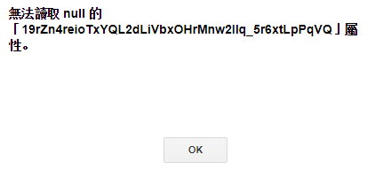
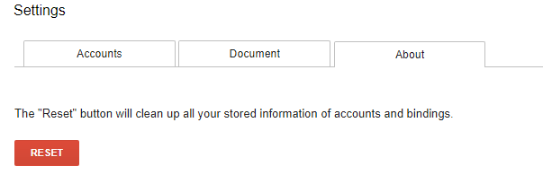

.. _h3ea173a382bc75126d3a223054245a:

Licenza, chi sono e ringraziamenti
**********************************

.. _h1482f5a3e68357570156a275b155066:

Licenza per questo tutorial
===========================

Questo tutorial viene rilasciato con licenza \ |LINK1|\ .

|

.. _hf5b2031567a394c245e7e192f6c7555:

Chi sono e perché nasce questo tutorial
=======================================

|REPLACE1|

Sono \ |LINK2|\ , dipendente del Comune di Palermo impegnato su \ |LINK3|\  e digitalizzazione e innovazione di processi e servizi. 

Civic hacker (\ |LINK4|\ ) con la passione della condivisione della conoscenza.

Mi piace moltissimo \ |LINK5|\  e \ |LINK6|\  quale piattaforma per la pubblicazione di documenti, ed è il motivo per il quale ho realizzato questo tutorial.

|

.. _h4c4429484d5e267f2550343b314f7d:

Iniziate le pubblicazioni su Read the Docs
==========================================

\ |LINK7|\  di pubblicazioni realizzate sullo stile di Read the Docs, molte delle quali in collaborazione con altre persone che condividono la cultura dell’architettura dell’informazione del documento.

|

.. _h186b2b1f107c6836f6f5948214c39a:

Un ringraziamento al creatore del componente aggiuntivo ``GGeditor``, Hsin Yuan Yeh
===================================================================================

\ |IMG1|\ 

\ |LINK8|\  espone le funzioni svolte dal \ |STYLE0|\  abbastanza bene. L’inglese adottato nel tutorial per le spiegazioni è anche di facile comprensione in quanto scritto da un bravo sviluppatore di Taiwan (\ |STYLE1|\ ), non madrelingua inglese.

Ha fatto un gran lavoro facilitando la vita a molte persone che non hanno la conoscenza del linguaggio RST, né la pazienza per apprenderlo.

|

.. _h75335c2c2416226121b76306b687836:

Un messaggio  di errore, facile da risolvere
============================================

|REPLACE2|

\ |STYLE2|\  ha fornito l’assistenza durante alcune sessioni di utilizzo del suo plugin nelle quali ho incontrato qualche problema di funzionamento (un messaggio di “\ |STYLE3|\ ” e un messaggio di error in lingua taiwanese) nella procedura di commit del Google Doc a Github. 

Ho aperto una issue (\ |LINK9|\ ) sul suo progetto Github e Hsin Yuan Yeh ha provveduto ad analizzare tempestivamente il problema. Ha fornito immediatamente una soluzione che è stata rilasciata da Google con una seconda release del componente aggiuntivo \ |STYLE4|\ . 

Praticamente se dovesse capitare di leggere un messaggio “\ |STYLE5|\ ” o un messaggio in lingua taiwanese del tipo 

↓

 \ |IMG2|\ 

la cosa da fare è: andare in “\ |STYLE6|\ ”, poi “\ |STYLE7|\ ” e quindi su “\ |STYLE8|\ ” dove si trova un tasto rosso di “\ |STYLE9|\ ” che cancella tutte le informazioni di collegamento agli account Github e ai relativi file nel repository.

\ |IMG3|\ 

L’ho provato e tutto ritorna in ordine e funziona correttamente nella procedura di Commit da Google Doc a Github. Ovviamente bisogna ricollegare il componente aggiuntivo GGeditor all’account di Github per potere continuare a effettuare i commits.

Grazie Hsin Yuan Yeh per questa tempestiva soluzione al problema!

|

.. _h6702940581a7d5e2242101c7463915:

``GGeditor``, un servizio online da utilizzare per la pubblicazione di documenti delle Pubbliche Amministrazioni
================================================================================================================

Mi auguro che la semplicità d’uso di questo strumento descritto nel tutorial possa stimolare i dipendenti e dirigenti pubblici, partendo da un Google Doc, a pubblicare documenti su Read the Docs e con lo stile Docs Italia, al posto degli scomodi PDF. Per chi fosse interessato ad utilizzare questo strumento, sono disponibile a fornire aiuto. Il mio contatto è:

``c.spataro @ comune.palermo.it``, ``cirospat @ gmail.com``

|REPLACE3|

|

|REPLACE4|

.. bottom of content

.. |STYLE0| replace:: **plugin**

.. |STYLE1| replace:: **Hsin Yuan Yeh**

.. |STYLE2| replace:: **Hsin Yuan Yeh**

.. |STYLE3| replace:: **undefined**

.. |STYLE4| replace:: **GGeditor**

.. |STYLE5| replace:: **undefined**

.. |STYLE6| replace:: **Componenti aggiuntivi**

.. |STYLE7| replace:: **GGeditor**

.. |STYLE8| replace:: **Setting**

.. |STYLE9| replace:: **Reset**

.. |REPLACE1| raw:: html

    
.. |REPLACE2| raw:: html

    
.. |REPLACE3| raw:: html

    
<a href="https://twitter.com/cirospat?ref_src=twsrc%5Etfw" class="twitter-follow-button" data-show-count="false">Follow @cirospat</a>

    
.. |REPLACE4| raw:: html

    
    
    

    
    <noscript>Please enable JavaScript to view the <a href="https://disqus.com/?ref_noscript">comments powered by Disqus.</a></noscript>

.. |LINK1| raw:: html

    <a href="https://creativecommons.org/licenses/by/4.0/deed.it" target="_blank">Creative Commons CC BY 4.0 (attribuzione)</a>

.. |LINK2| raw:: html

    <a href="http://cirospat.readthedocs.io" target="_blank">Ciro Spataro</a>

.. |LINK3| raw:: html

    <a href="https://opendata.comune.palermo.it/" target="_blank">open data</a>

.. |LINK4| raw:: html

    <a href="http://opendatasicilia.it" target="_blank">Opendatasicilia</a>

.. |LINK5| raw:: html

    <a href="http://readthedocs.io/" target="_blank">Read the Docs</a>

.. |LINK6| raw:: html

    <a href="https://docs.developers.italia.it/" target="_blank">Docs Italia</a>

.. |LINK7| raw:: html

    <a href="https://docs.google.com/spreadsheets/d/e/2PACX-1vTu5QDGhwYWE1gXsousI_KRF_VEJGcj144ybek4yGu-EDO92oKRQAXf82FnBOYowZ8IFhqEpiKX3wxM/pubhtml" target="_blank">Qui un primo catalogo</a>

.. |LINK8| raw:: html

    <a href="http://ggeditor.readthedocs.io" target="_blank">Il tutorial di GGeditor</a>

.. |LINK9| raw:: html

    <a href="https://github.com/iapyeh/GGeditor/issues/1" target="_blank">https://github.com/iapyeh/GGeditor/issues/1</a>

.. |IMG1| image:: static/licenza_1.png
   :height: 106 px
   :width: 601 px

