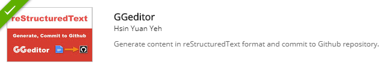

.. _h3ea173a382bc75126d3a223054245a:

Licenza, chi sono e ringraziamenti
**********************************

.. _h1482f5a3e68357570156a275b155066:

Licenza per questo tutorial
===========================

Questo tutorial viene rilasciato con licenza \ |LINK1|\ .

.. _h2b72783b52451b1466716442d68d:

Chi sono e perché questo tutorial
=================================

Ciro Spataro, dipendente del Comune di Palermo impegnato su open data e digitalizzazione di processi e servizi. 

Civic hacker con la passione della condivisione della conoscenza.

Mi piace moltissimo \ |LINK2|\  quale piattaforma per la pubblicazione di documenti, ed è il motivo per il quale ho realizzato questo tutorial.

.. _h2a134943434130395172b293d13a:

Un ringraziamento a Hsin Yuan Yeh
=================================

\ |LINK3|\  espone le funzioni svolte dal plugin abbastanza bene. L’inglese adottato nel tutorial per le spiegazioni è anche di facile comprensione in quanto scritto da un bravo sviluppatore di Taiwan (Hsin Yuan Yeh).

Ha fatto un gran lavoro facilitando la vita a molte persone che non hanno la conoscenza del linguaggio RST.

Un ringraziamento particolare va  a lui per l’assistenza che mi ha fornito durante alcune sessioni di utilizzo del suo plugin nelle quali ho incontrato qualche problema di funzionamento (un “undefined” messaggio). Hsin Yuan Yeh ha provveduto ad analizzare tempestivamente il problema al quale sta cercando una soluzione per rilasciare una seconda release del plugin.

\ |IMG1|\ 

|REPLACE1|

|REPLACE2|

.. bottom of content

.. |REPLACE1| raw:: html

    
    
    

    
    <noscript>Please enable JavaScript to view the <a href="https://disqus.com/?ref_noscript">comments powered by Disqus.</a></noscript>
.. |REPLACE2| raw:: html

    <a href="https://twitter.com/cirospat?ref_src=twsrc%5Etfw" class="twitter-follow-button" data-show-count="false">Follow @cirospat</a>

.. |LINK1| raw:: html

    <a href="https://creativecommons.org/licenses/by-sa/4.0/deed.it" target="_blank">Creative Commons CC BY (attribuzione) SA (condividi allo stesso modo)</a>

.. |LINK2| raw:: html

    <a href="http://readthedocs.io/" target="_blank">Read the Docs</a>

.. |LINK3| raw:: html

    <a href="http://ggeditor.readthedocs.io" target="_blank">Il tutorial di GGeditor</a>

